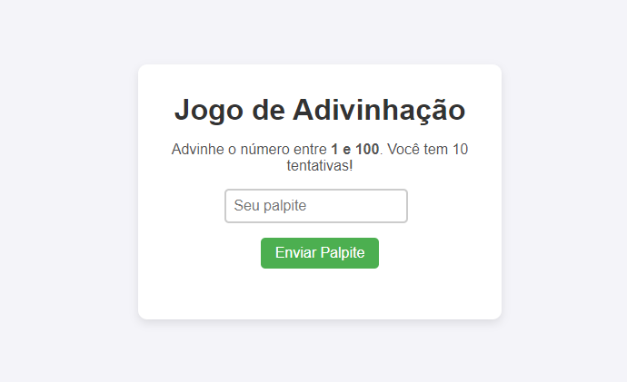

# Jogo de Adivinhação

Este é um jogo interativo de adivinhação implementado com **HTML**, **CSS** e **JavaScript**. O objetivo do jogador é adivinhar um número aleatório entre 1 e 100 com até 10 tentativas. O jogo fornece dicas se o palpite é maior ou menor que o número correto e exibe uma mensagem ao final do jogo, seja de vitória ou derrota.

## Funcionalidades

* Geração de um número aleatório entre 1 e 100.
* O jogador tem 10 tentativas para adivinhar o número.
* Feedbacks dinâmicos indicando se o palpite é maior ou menor que o número secreto.
* Mensagem de vitória ao acertar o número.
* Mensagem de derrota quando as tentativas se esgotam.
* Opção de reiniciar o jogo após o término.

## Tecnologias Utilizadas

* **HTML5**: Estrutura da interface do jogo.
* **CSS3**: Estilização do jogo, incluindo layout responsivo.
* **JavaScript**: Lógica do jogo e controle de interações.

## Estrutura do Projeto

O projeto é organizado em três arquivos principais:

* **index.html**: Contém a estrutura HTML do jogo.
* **styles.css**: Arquivo de estilo para definir a aparência da interface.
* **script.js**: Contém a lógica do jogo, como geração de número aleatório, controle das tentativas e exibição de mensagens de feedback.

### Estrutura de Pastas

```
├── index.html    # Estrutura HTML do jogo
├── styles.css    # Arquivo de estilo para a interface do jogo
├── script.js     # Lógica do jogo
└── README.md     # Instruções e documentação do projeto
```

## Instalação e Uso

Para utilizar o jogo localmente:

1. Faça o clone do repositório ou baixe o código-fonte.

```bash
git clone https://github.com/seu-usuario/jogo-adivinhacao.git
```

2. Abra o arquivo `index.html` no seu navegador de preferência.
   * O jogo estará disponível para uso diretamente no navegador.

## Como Jogar

1. Digite um número entre **1 e 100** no campo de palpite.
2. Clique no botão **Enviar Palpite**.
3. O jogo fornecerá dicas informando se o número é maior ou menor que o palpite.
4. Continue jogando até acertar o número ou esgotar suas 10 tentativas.
5. Ao final, clique no botão **Reiniciar Jogo** para jogar novamente.

## Layout Responsivo

O design do jogo é totalmente responsivo, garantindo que ele seja acessível e jogável em dispositivos móveis, tablets e desktops. O layout se ajusta automaticamente para diferentes tamanhos de tela, oferecendo uma experiência consistente.

## Jogo de Adivinhação




## Melhorias Futuras

Algumas possíveis melhorias para o jogo incluem:

* Adicionar níveis de dificuldade com diferentes intervalos de números.
* Implementar um sistema de pontuação baseado no número de tentativas restantes.
* Adicionar efeitos sonoros para feedbacks visuais e sonoros durante o jogo.

## Contribuição

Contribuições são bem-vindas! Se você deseja melhorar o projeto, sinta-se à vontade para abrir um *pull request* ou relatar problemas na seção de *issues*.

## Licença

Este projeto está licenciado sob a MIT License.
